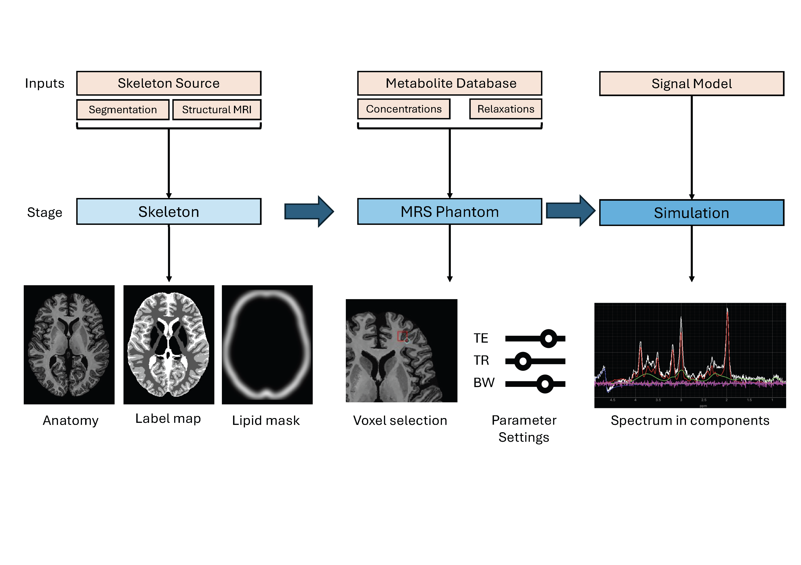

# MRS Digital Brain Phantom Framework

## Overview
This repository contains the code for the **MRS Digital Brain Phantom Framework**, a tool for simulating Magnetic Resonance Spectroscopy (MRS) data. The framework is designed to be comprehensive and flexible, allowing researchers to generate MRS data efficiently for their own applications.

<figure style="text-align: center;">
    
    <figcaption>Figure 1: Structure of the 3D MRS digital brain phantom framework. The framework is divided into three stages: Skeleton, MRS Phantom, and Simulation. Each stage allows for user-defined inputs, making the framework highly modular and customizable for various applications. This example uses the ‘BigBrain-MR’ skeleton source.</figcaption>
</figure>

## Getting Started

### Using Pixi

On MacOS and linux you can use the [Pixi](https://pixi.sh/latest/) package manager to run the simulator.

First [install Pixi](https://pixi.sh/latest/installation/) by running `curl -fsSL https://pixi.sh/install.sh | sh`

Then run the simulator by calling `pixi run simulator` in the cloned repository.

### Prerequisites

Ensure the following dependencies are installed:

- **[Python ≥ 3.10](https://www.python.org/)**  
- **[Conda](https://docs.conda.io/en/latest/)** *(optional but recommended)*  
- **[Jupyter](https://jupyter.org/install)** (JupyterLab or Jupyter Notebook, to run `.ipynb` files)

- **GNU Octave ≥ 4.0**  
  Required for simulating lipid signals and basis sets.

  **Installation instructions:**

  - **Windows**  
    Download the latest *MinGW* version from the [GNU Octave website](https://www.gnu.org/software/octave/download.html).  
    During installation, make sure to add Octave to your system's `PATH`. You can do this during setup or by manually adding the path to the `bin` directory to your environment variables.

  - **macOS**  
    Install using Homebrew:

    ```bash
    brew install octave
    ```

  - **Linux**  
    Use your distribution’s package manager. For example, on Ubuntu:

    ```bash
    sudo apt-get update
    sudo apt-get install octave
    ```

  **To verify installation**, run:

  ```bash
  octave --version
### Installation

This project uses a `pyproject.toml` file to declare dependencies and package metadata according to [PEP 621](https://peps.python.org/pep-0621/). You can install the project and its dependencies using standard Python tools.

### 1. Clone the repository

```bash
git clone https://github.com/dennisvds/MRS-Digital-Phantom.git
cd MRS-Digital-Phantom
```

### 2. Create and activate a new virtual environment (recommended)
#### Using `conda`:
```bash
conda create -n mrs-phantom python=3.10
conda activate mrs-phantom
```
#### Using `venv`:
```bash
python -m venv .venv
source .venv/bin/activate        # macOS/Linux
.venv\Scripts\activate           # Windows
```

### 3. Install dependencies
To install all relevant dependencies, run:
```bash
pip install .
```
This installs your package along with all dependencies listed in `pyproject.toml`

### 4. Install `fsl-mrs`
This project also depends on `fsl-mrs`, which cannot be installed via `pip`. If using `conda` you can install it using:
```bash
conda install -c conda-forge \
              -c https://fsl.fmrib.ox.ac.uk/fsldownloads/fslconda/public/ \
              fsl_mrs
```
For detailed instructions and other install options, have a look at the [**Installation Instructions**](https://open.win.ox.ac.uk/pages/fsl/fsl_mrs/install.html) in the user documentation. 


### 5. Downloading Data
To use the **BigBrain-MR phantom**, you can download the data [**here**](https://zenodo.org/records/7432527). All other data is available in this respository. If you want to use your own skeletons adjustments to the code might be needed.


## Directory Structure
The following directory structure is used in this project:
```
MRS_Digital_Phantom/
├── data/                           # Main folder to store the data
│   ├── bassissets/                 # Folder to store basissets
│   ├── invivo/                     # In-vivo data for comparison analysis
│   ├── macromolecules/             # Data for metabolite
│   ├── metabolites/                # Data from the MRiLab phantom
│   ├── skeletons/                  # Folder to store all MRS Phantom data
├── gui/                            # Scripts needed to generate and run the GUI elements
├── installation/                   # Scripts for installing the necessary packages
├── media/                          # Folder containing images for illustration
├── notebooks/                      # Folder containing notebooks used for results in the paper
│   ├── analysis.ipynb              # Notebook used to generate paper results for in-vivo vs simulated data comparison
│   ├── generate_data.ipynb         # Notebook used to generate batches of simulated data using configuration files
│   ├── plot_variations.ipynb       # Notebook used to generate paper results for variations in simulated data
├── outputs/                        # Folder containing simulation outputs used in the publication
├── simulation/                     # Folder with simulation scripts and signal models
│   ├── basissets/                  # Code for generating basissets using MRSCloud [REF]
│   ├── FID-A/                      # FID-A code needed for basisset and lipid generation
│   ├── lipids/                     # Code for generating lipid signal based on SimnTG
│   ├── macromolecules/             # Code for generating macromolecules signals based on
│   ├── water                       # Code for generating residual water signals based on
├── utils/                          # Utility scripts for plotting, loading, and setting definitions
├── config.json                     # Example of a configuration file in .JSON format
├── main.py                         # Main script that runs the GUI
├── environment.yml                 # Conda environment file
├── requirements.txt                # Python dependencies
└── README.md                       # Project documentation (this file)
```

## Usage

With everything installed and the data in the correct folder structure, you can run the MRS digital phantom:
```bash
python main.py
```
This will open the GUI, which may take a few moments to launch.

<figure style="text-align: center;">
    
    <figcaption> Figure 2: Screenshot of the graphical user interface (GUI) of the digital MRS phantom. The left panel (green box) displays settings for the skeleton, metabolite dataframe, and basis set. The top panel (purple box) shows the three orthogonal brain views used for voxel placement. The bottom-middle section (blue box) contains the simulation settings panel and message box. The right panel (red box) visualizes the simulated spectrum, including its individual signal components. </figcaption>
</figure>

> #### Stability Note
> While the GUI is fully functional and has been tested across platforms, users may occasionally encounter instability  
> (e.g., unexpected crashes or segmentation faults), especially when using certain Python/Qt configurations or interactive environments.  
>
> We recommend launching the GUI from a clean virtual environment and avoiding conflicting toolkits or background processes.  
> If issues persist, restarting the environment or switching between `pip` and `conda` installations of PyQt5 may help.  


### Notebooks
There are a couple of Jupyter Notebooks available in this repository that will go over the batch-wise generation of spectra and analysis methods. These notebooks were used to create the figures in the corresponding paper. [View the Notebooks](https://github.com/dennisvds/MRS_Digital_Phantom/blob/main/Demo_MRS_Phantom.ipynb).

## Contact, Feedback, Suggestions
This MRS Digital Brain Phantom is a never-ending project! We are happy to receive your questions, feedback, suggestions, or critique by sending an email to:
**Dennis van de Sande** (d.m.j.v.d.sande@tue.nl)

## Citation
Should you publish any material that made use of this MRS Phantom Framework, please cite the following paper:

*Preprint (currently under review)*:

[D.M.J. van de Sande, A.T. Gudmundson, S. Murali-Manohar, C.W. Davies-Jenkins, D. Simicic, G. Simegn, İ. Özdemir, S. Amirrajab, J.P. Merkofer, H.J. Zöllner, G. Oeltzschner, R.A.E. Edden A Digital Phantom for MR Spectroscopy Data Simulation.
](https://arxiv.org/abs/2412.15869)


## License
This project is licensed under the [MIT License](https://github.com/dennisvds/MRS_Digital_Phantom/blob/main/LICENSE.md).

## Acknowledgments
This work has been (partially) funded by:
- European ITEA4 program (project 20209)